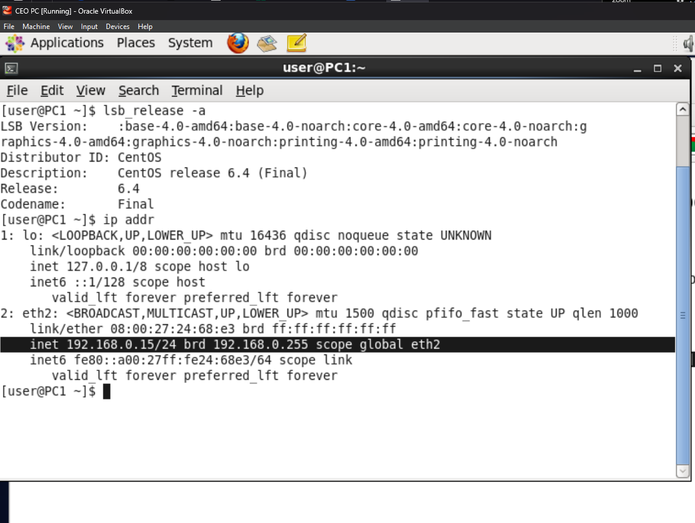
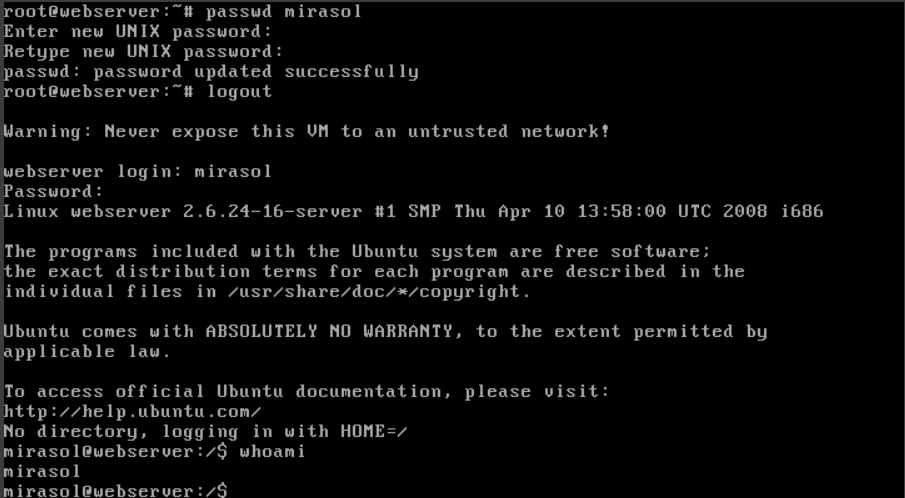

# Secure-Network-Simulation

## Overview
This project simulates the setup, configuration, and security of a virtualized network environment as part of the **UC Santa Barbara Professional and Continuing Education Cybersecurity Program**. The objective is to deploy a network that meets a client’s needs within budget and space constraints. Virtual machines (VMs) are used to implement essential components, including firewalls, web servers, DNS servers, and monitoring systems.

This project demonstrates practical skills in deploying, configuring, and securing IT systems. Through troubleshooting, network analysis, and security baselining, this simulation provides hands-on experience in establishing network solutions tailored to operational and budgetary requirements.

---
## Scenario
You have been hired by an **IT company** as an **IT subject matter expert**. The management team has a **client who wants to upgrade their IT systems**, but the client has a **limited budget** and **no more physical space** to install new equipment. 

To solve this issue, you suggest implementing **virtual machines** instead of additional hardware to help **reduce costs** and meet the client’s operational needs. As part of the upgrade, the following components will be installed:
- **Firewall**
- **CEO's PC**
- **Internal Webserver**
- **Internal DNS server**
- **Linux machines** for monitoring and conducting cybersecurity tasks

Once the new network is installed, your task is to **document configurations** and create a **security baseline** by scanning for **open ports**.


---

## Technologies and Tools Used
- **VirtualBox:** Used to create and manage virtual machines.
- **Kali Linux and Other Linux Distributions:** Utilized for security testing, network monitoring, and diagnostic tasks (e.g., ping, FTP).
- **Wireshark:** Used for capturing and analyzing network traffic.
- **VMs Deployed:** Router-FW, DNS Server, Web Server, CEO PC, and Kali Linux (Trusted/Untrusted).

---

## Tasks and Deliverables

### Project Tasks  

1. **Verify Network Connectivity**  
   The CEO PC must be able to access [seclab.net](http://www.seclab.net). If the page fails to load, troubleshoot using Linux commands (e.g., `ping`) to diagnose network issues between machines.

---

#### **Solution: Verify Network Connectivity**

1. **Attempt to Access seclab.net via Firefox**  
   - **Action:** Launched Firefox on the CEO PC and navigated to **`www.seclab.net`**.  
   - **Result:** Firefox displayed a **"Server not found"** error, indicating a potential connectivity issue.  
   

2. **Ping the Web Server (10.200.0.12)**  
   - **Action:** Executed `ping 10.200.0.12` from the CEO PC to test connectivity to the web server.  
   - **Result:** Received **"Destination Host Unreachable"**, confirming the web server was not accessible from the CEO PC.  
   

3. **Ping the DNS Server (10.200.0.11)**  
   - **Action:** Ran `ping 10.200.0.11` to check connectivity with the DNS server.  
   - **Result:** Received **"Destination Host Unreachable"**, indicating that the DNS server was also inaccessible.  
   

4. **Inspect the IP Configuration**  
   - **Action:** Used the command `ip addr` on the CEO PC to review the network interface settings.  
   - **Result:**  
     - The **IP address** was incorrectly set to **203.0.113.69/24**, which does not align with the expected **192.168.0.0/24** trusted network.  
     - This incorrect IP address caused the CEO PC to be isolated from the DMZ and other internal resources.  
   

5. **Analyze and Adjust IP Settings**  
   - **Action:** Checked the **IPv4 settings** of the **Auto eth2** connection.  
   - **Result:**  
     - The **IP address**, **default gateway**, and **DNS server** were incorrectly set within the **203.0.113.0/24 subnet**, preventing proper communication.  
     - According to the **network diagram**:
       - The CEO PC should have an IP address within the **192.168.0.0/24 trusted network**.
       - The **default gateway** should also be within the **trusted network** (192.168.0.x) for correct routing.
       - The **DNS server** should be accessible within the **DMZ (10.200.0.8/29)**, allowing name resolution for internal services.  
   

6. **Switch to Automatic DHCP Configuration**  
   - **Decision:**  
     - **Option 1:** Manually assign the correct IP, gateway, and DNS settings to align with the trusted network.  
     - **Option 2:** Switch to **Automatic DHCP** to dynamically receive the appropriate network configuration.

   - **Chosen Solution:**  
     The decision to use **Automatic DHCP** ensured that the CEO PC would receive the correct IP address, gateway, and DNS settings without manual intervention.  
     
     During the import of virtual machines into **VirtualBox**, the option to **"Include all network adapter MAC addresses"** was enabled. This choice guaranteed that each virtual machine, including the CEO PC, would receive a unique MAC address, avoiding potential conflicts.  
     
     Using DHCP reduced the risk of human error and ensured that network settings aligned with the trusted network configuration. This approach provided a more reliable, scalable solution for maintaining proper connectivity across all virtual machines.  
   

7. **Test Connectivity to Web and DNS Servers**  
   - **Action:**  
     - Ran `ping -c6 10.200.0.12` to verify communication with the web server.  
     - Ran `ping -c4 10.200.0.11` to check connectivity with the DNS server.  

   - **Result:** Both pings were **successful**, confirming that communication with the servers had been restored.  
     
   

8. **Reopen Firefox and Confirm Access to seclab.net**  
   - **Action:** Launched Firefox again and navigated to **`www.seclab.net`**.  
   - **Result:** The page loaded successfully, confirming the network issue was resolved.  
   

---

2. **Document IP Configuration**  
   Record the OS version, IP address, subnet mask, default gateway, and DNS server address for the following:
   - CEO PC  
   - Web Server  
   - DNS Server

---

#### **Solution: Document IP Configuration**

> **Note:** The `ip addr` command was used to retrieve the **IP address**, and the `ifconfig` command was used to verify both the **IP address** and **subnet mask** where necessary.

For each system, the following commands were used:
- **OS Version:** `lsb_release -a` or `cat /etc/*rel*` (depending on the OS).
- **IP Address:** `ip addr` or `ifconfig`.
- **Subnet Mask:** Retrieved from `ifconfig`.
- **Default Gateway:** `ip route`.
- **DNS Server:** `cat /etc/resolv.conf`.

### CEO PC  
- **OS Version**:  
  - Command: `lsb_release -a`  
  - **Result**: CentOS 6.4  
  

- **IP Address**:  
  - Command: `ip addr`  
  - **Result**: `192.168.0.15/24`  
  

- **Subnet Mask**:  
  - Command: `ifconfig`  
  - **Result**: IP `192.168.0.15` with Subnet Mask `255.255.255.0`  
  

- **Default Gateway**:  
  - Command: `ip route`  
  - **Result**: Default Gateway `192.168.0.1`  
  

- **DNS Server**:  
  - Command: `cat /etc/resolv.conf`  
  - **Result**: DNS Server `10.200.0.11`  
  

---

### Web Server  
- **OS Version**:  
  - Command: `lsb_release -a`  
  - **Result**: Ubuntu  
  

- **IP Address and Subnet Mask**:  
  - Command: `ifconfig`  
  - **Result**: IP `10.200.0.12` with Subnet Mask `255.255.255.248`  
  

- **Default Gateway**:  
  - Command: `ip route`  
  - **Result**: Default Gateway `10.200.0.9`
  
- **DNS Server**:  
  - Command: `cat /etc/resolv.conf`  
  - **Result**: DNS Server `10.200.0.11`
  
---

### DNS Server  
- **OS Version**:  
  - Command: `cat /etc/*rel*`  
  - **Result**: CentOS 6.4  
  

- **IP Address and Subnet Mask**:  
  - Command 1: `ip addr`  
    - **Result**: IP `10.200.0.11/29`  
    

  - Command 2: `ifconfig`  
    - **Result**: IP `10.200.0.11` with Subnet Mask `255.255.255.248`  
    

- **Default Gateway**:  
  - Command: `ip route`  
  - **Result**: Default Gateway `10.200.0.9`  
  


---

3. **Download Social Media Security Policy via FTP**  
   From the CEO PC, use FTP to download the policy document from the web server.
---

#### **Solution: Download Social Media Security Policy via FTP**

1. **Initiate FTP Connection**  
   - **Command:** `ftp`  
   - Opened an FTP connection to the **web server** with the command:  
     ```bash
     open 10.200.0.12
     ```
   - Entered the **username:** `jasper` and **password** when prompted.

2. **List Available Files on FTP Server**  
   - **Command:** `ls`  
   - Entered **Passive Mode** and confirmed that the file **Social-Media-Security-Policy** was available:
     ```text
     April 16 2020  Social-Media-Security-Policy
     ```

   

3. **Download the Social Media Security Policy**  
   - **Command:** `get Social-Media-Security-Policy`  
   - The transfer was completed successfully, confirming that the file was downloaded.

4. **Close the FTP Connection**  
   - **Command:** `close`  
     - Response: **221 Goodbye**  
   - **Command:** `exit`  

5. **Verify the Downloaded File**  
   - **Command:** `ls`  
   - Confirmed that the **Social-Media-Security-Policy** file was successfully downloaded to the CEO PC.

   

6. **Open the Social Media Security Policy Document**  
   - Opened the **Social-Media-Security-Policy** file on the CEO PC to verify the content.

   
   ### **Summary of the Social Media Security Policy**  
   The **Social Media Security Policy** document is a **draft policy** for **Robot Parts, Inc.** It highlights the company’s strategic use of social media for marketing and business purposes, as well as the importance of protecting the organization from social media threats. Key points from the policy include:

   1. **Importance of Social Media:**  
      - Social media plays a critical role in promoting the company and interacting with customers to build brand awareness.

   2. **Managing Social Media Risks:**  
      - The company acknowledges the growing risks from the **social media threat landscape** and the need to protect its **reputation, customers, and employees** from these risks.

   3. **Commitment to Cybersecurity Best Practices:**  
      - The policy emphasizes adherence to **cybersecurity best practices** and holds the company accountable for responsible social media management.

   4. **Access Management:**  
      - The company will define tools and authorized personnel to manage social media accounts, though further details are to be added in the final version.

   5. **Policy Review and Incident Response:**  
      - The policy requires **annual reviews** and updates by the social media and cybersecurity teams.
      - In the event of a **security incident**, the policy mandates immediate review to identify areas for improvement.


---
4. **Create a New User on the Web Server**  
   Add a new user with a chosen username and password on the web server.
   #### **Solution: Create a New User on the Web Server**

1. **Logged in as Root:**  
   - Already logged in as the `root` user on the web server.

2. **Add New User:**  
   - Executed the command:  
     ```bash
     useradd mirasol
     ```
   - Verified the creation of the user by checking `/etc/passwd` using:  
     ```bash
     cat /etc/passwd
     ```
   - The output showed that the `mirasol` user was successfully created (see the last line).  
     

3. **Set Password, Logout, and Login as New User:**  
   - All the steps for setting the password, logging out from the root session, logging in as the new user `mirasol`, and verifying the login are captured in the following screenshot:
     1. **Set Password:** Used the `passwd mirasol` command to assign a password to the new user.
     2. **Logout:** Logged out of the `root` session.
     3. **Login:** Logged in as `mirasol` with the new credentials.
     4. **Verify:** Executed `whoami` to confirm the current user is `mirasol`.  
   
   
---
5. **Perform Port Scans Using Nmap**  
   Use Nmap from a Kali Linux machine to scan the DNS and Web servers. Document all open ports and associated protocols.

   #### **Solution: Perform Port Scans Using Nmap**

1. **Scan on Web Server (10.200.0.12)**  
   - Executed the following command:  
     ```bash
     nmap 10.200.0.12
     ```
   - **Result:** The scan revealed multiple open ports and services running on the web server, such as FTP, HTTP, and SSH.  
     

---

2. **Scan on DNS Server (10.200.0.11)**  
   - Executed the following command:  
     ```bash
     nmap 10.200.0.11
     ```
   - **Result:** The scan identified SSH and DNS services running on the DNS server.  
     


   These scans provide visibility into the services running on the **Web** and **DNS servers**, ensuring they align with expected configurations and highlighting any potential security exposures.
---
6. **Verify that the Trusted network is protected from the Untrusted network.**
   ### **Solution: Verify Network Protection**

   Step 1. **Check IP Address of the Kali Untrusted VM**  
   - Ran the `ifconfig` command on the **Kali Untrusted** virtual machine to confirm the IP address.  
     - The IP address was **172.30.0.10**, which is **within the 172.30.0.0/24 Untrusted Network**, as indicated in the network diagram.

   

   Step 2. **Ping from Kali Trusted to Kali Untrusted VM**  
   - From the **Kali Trusted** virtual machine, executed the following command to ping the **Kali Untrusted** machine:
     ```bash
     ping -c5 172.30.0.10
     ```
   - **Result:** The ping was **successful**, indicating that the **Kali Trusted** machine was able to communicate with the **Kali Untrusted** machine, as expected.

   

   Step 3. **Ping from Kali Untrusted to Kali Trusted VM**  
   - From the **Kali Untrusted** virtual machine, attempted to ping the **Kali Trusted** machine:
     ```bash
     ping -c5 192.168.0.19
     ```
   - **Result:** The ping was **unsuccessful**, demonstrating that the **Trusted Network** was protected from the **Untrusted Network**.

   

   Step 4. **Referencing the Network Diagram**  
   - As per the **network diagram**, the **Kali Trusted VM** is part of the **192.168.0.0/24 Trusted Network**, and the **Kali Untrusted VM** belongs to the **172.30.0.0/24 Untrusted Network**.  
   - This configuration confirms the intended **network segmentation**, ensuring that traffic from the untrusted network is blocked from accessing the trusted network’s resources, as designed.
---

7. **Capture FTP Traffic with Wireshark**  
   Use Wireshark on Kali Linux to monitor an FTP session between the CEO PC and the Web Server. Capture the username and password transmitted during the session.
   #### **Solution: Capture FTP Traffic with Wireshark**
   ## Step 1: Initiate FTP Session from CEO PC

      1. On the CEO PC, I used the `ftp` command.
      2. I connected to the Web Server at IP address **10.200.0.12**.
      3. Logged in with the username **jasper**.
      4. Executed the `ls` command to display the available files, confirming the presence of the `Social-Media-Security-Policy`.

   

   ## Step 2: Download the File and Monitor Traffic

      1. I used the `get Social-Media-Security-Policy` command to download the file.

   

   2. In Wireshark, I captured the FTP login sequence, including the USER and PASS commands, revealing the username (jasper) and password (2hard2guess) transmitted in plaintext, followed by the 230 Login successful response.

   
---

## Network Diagram  
Below is the network diagram showcasing the design and setup of the virtualized network.


